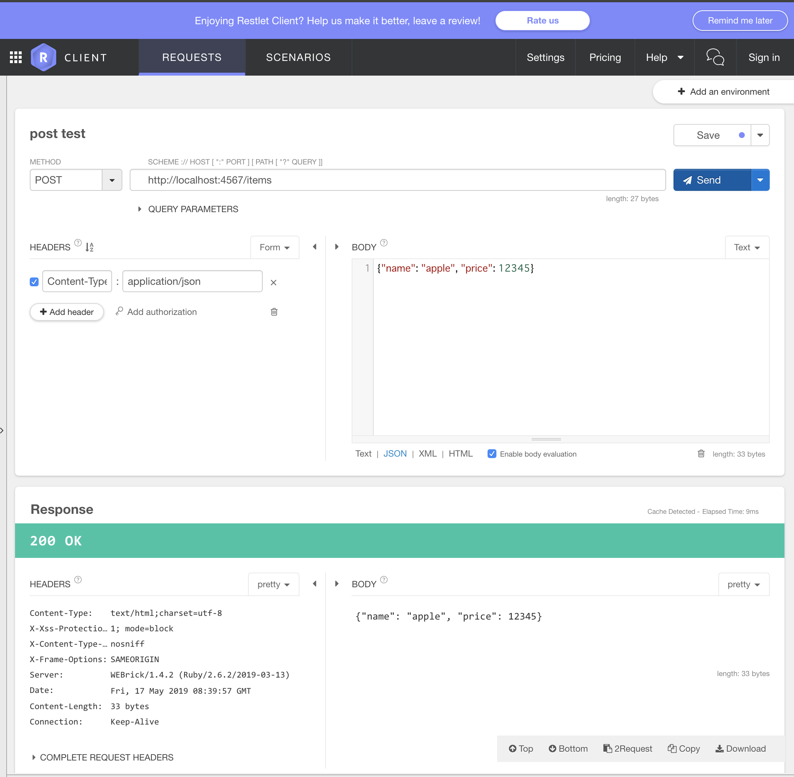

Sinatra Sample
===

- Ruby 2.6.2

## 初回
```
$ bundle install --path vendor/bundle
```

## 起動
```
$ ruby app.rb
```

Webブラウザで http://localhost:4567 にアクセス！

## API Test ツール
https://chrome.google.com/webstore/detail/restlet-client-rest-api-t/aejoelaoggembcahagimdiliamlcdmfm

## 遊び方
1. サーバーを起動する
2. REST Clientでリクエストを送ってみる


### REST Clientの使い方
#### Get


#### パラメータを含むGet


#### Post


